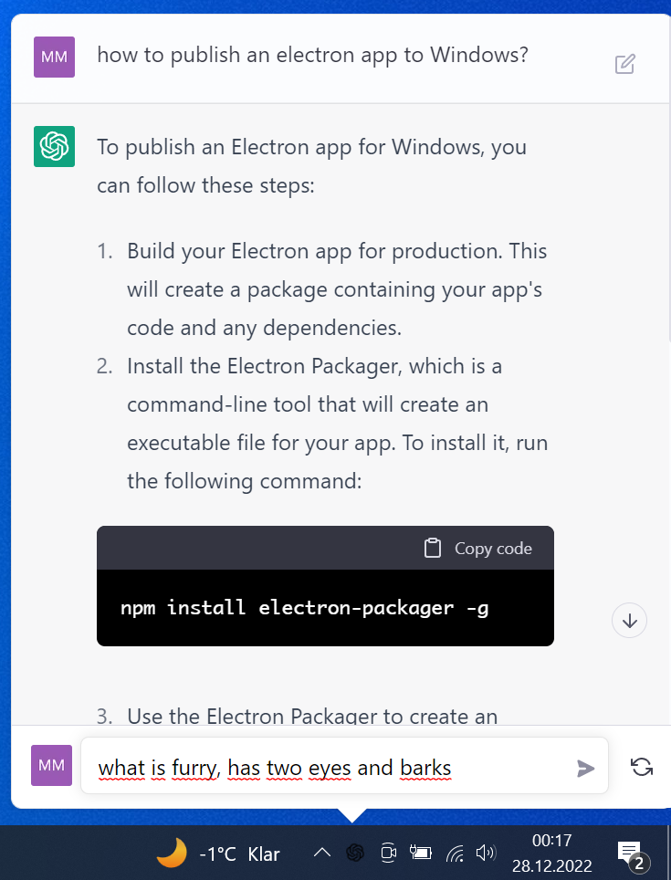

# ChatGPT for desktop

This is a simple app that makes ChatGPT live in your menubar.

You can use Ctrl+Shift+G (Win) or Cmd+Shift+G (Mac) to quickly open it from anywhere.

Download:
- [Win 64bit .exe](https://github.com/mmeggs2/chatgpt-electron/releases/download/untagged-c35f4779ed97a293d405/ChatGPT-0.0.5.Setup.exe)

- [Mac Arm64 .dmg](https://github.com/mmeggs2/chatgpt-mac/releases/download/v0.0.5/ChatGPT-0.0.5-arm64.dmg)
- [Mac Intel .dmg](https://github.com/mmeggs2/chatgpt-mac/releases/download/v0.0.5/ChatGPT-0.0.5-x64.dmg)

If you want to build it for yourself. 
 1. Clone the repo
 2. npm install
 3. npm run package 

  
  

## Credit

All credit and copyrights goes to OpenAI.

## Author

Project was forked from https://github.com/vincelwt/chatgpt-mac.
